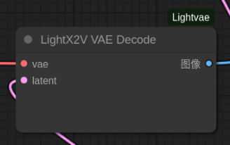

# ComfyUI-LightVAE

<div align="center">


**High-Performance VAE Custom Nodes**

[](https://huggingface.co/lightx2v/Autoencoders)
[](https://github.com/ModelTC/LightX2V)
[](LICENSE)

English | [简体中文](README_CN.md)

</div>


## 📖 Introduction

ComfyUI-LightVAE is a collection of LightX2V VAE custom nodes designed for ComfyUI, supporting high-performance video VAE models including **LightVAE** and **LightTAE**.

The LightX2V team has deeply optimized VAE, creating two major series: **LightVAE** and **LightTAE**, which significantly reduce memory usage and improve inference speed while maintaining high quality.


## ✨ Key Features

<table>
<tr>
<td width="50%">

### 🎯 LightVAE Series
**Feature: Best Balance ⚖️**

- ✅ Uses **Causal 3D Conv** (same as official)
- ✅ **Near-official quality** ⭐⭐⭐⭐
- ✅ **~50% less memory** (~4-5 GB)
- ✅ **2-3x faster**
- ✅ Balances quality, speed, and memory 🏆

</td>
<td width="50%">

### ⚡ LightTAE Series
**Feature: Ultra-fast + High Quality 🏆**

- ✅ Minimal memory usage (~0.4 GB)
- ✅ Lightning-fast inference
- ✅ **Near-official quality** ⭐⭐⭐⭐
- ✅ **Surpasses open-source TAE**

</td>
</tr>
</table>


## 🚀 Performance Comparison

**Test Environment**: H100 GPU, BF16, 81-frame video (480P)

| Model | Encode Time | Decode Time | Encode Memory | Decode Memory | Quality |
|:------|:------------|:------------|:--------------|:--------------|:--------|
| **lightvaew2_1** | 1.5s | 2.1s | 4.8GB | 5.6GB | ⭐⭐⭐⭐⭐ |
| **lighttaew2_1** | 0.4s | 0.25s | 0.009GB | 0.4GB | ⭐⭐⭐⭐ |
| [Wan2.1_VAE](https://github.com/Wan-Video/Wan2.1) | 4.2s | 5.5s | 8.5GB | 10.1GB | ⭐⭐⭐⭐ |
| [taew2_1](https://github.com/madebyollin/taesd) | 0.4s | 0.25s | 0.009GB | 0.4GB | ⭐⭐⭐ |

**Performance Improvements:**
- 🚀 LightVAE is **2-3x faster** than official VAE, **50% less memory**
- ⚡ LightTAE is **10+ times faster** than official VAE, **95%+ less memory**
- 🎨 Near-official [VAE](https://github.com/Wan-Video/Wan2.1) quality, surpasses open-source [TAE](https://github.com/madebyollin/taesd)


## 📦 Installation

### 1. Install LightX2V Dependencies

# vae requirements windows example 
...comfy\python_embeded\python.exe -s -m pip install -r requirements.txt  


```bash
# Clone LightX2V repository
git clone https://github.com/ModelTC/LightX2V
cd LightX2V

python setup_vae.py install
# windows example
...comfy\python_embeded\python.exe setup_vae.py install

```

### 2. Install ComfyUI-WanVideoWrapper

LightVAE nodes depend on WanVideoWrapper for main model support:

```bash
cd ComfyUI/custom_nodes
git clone https://github.com/kijai/ComfyUI-WanVideoWrapper
```

### 3. Install ComfyUI-LightVAE

```bash
cd ComfyUI/custom_nodes
git clone https://github.com/YOUR_USERNAME/ComfyUI-LightVAE
```

### 4. Restart ComfyUI


## 📥 Download Models

### Main Models (Diffusion Models)

**Option 1: Distilled Models (Recommended, 4-step)**
- 🔗 [Wan2.1 Distilled Models](https://huggingface.co/lightx2v/Wan2.1-Distill-Models) and [Wan2.2 Distilled Models](https://huggingface.co/lightx2v/Wan2.2-Distill-Models)
- ✅ Supports BF16 format
- ✅ Supports FP8 format (requires models with `_comfyui.safetensors` suffix)

**Option 2: Original Models (20-step)**
- 🔗 [Wan2.1 Official Models](https://huggingface.co/lightx2v/Wan2.1-Official-Models) and [Wan2.2 Official Models](https://huggingface.co/lightx2v/Wan2.2-Official-Models)
- ✅ Supports BF16 format
- ✅ Supports FP8 format (requires models with `_comfyui.safetensors` suffix)

```bash
# Download to ComfyUI/models/diffusion_models/
huggingface-cli download lightx2v/Wan2.1/2-Distill-Models \
    --local-dir ./ComfyUI/models/diffusion_models/
```

### VAE Models

**All VAE Models** (Required):
- 🔗 [LightX2V Autoencoders](https://huggingface.co/lightx2v/Autoencoders)

```bash
# Download all VAE models
huggingface-cli download lightx2v/Autoencoders \
    --local-dir ./ComfyUI/models/vae/

# Or download only what you need (Recommended)
huggingface-cli download lightx2v/Autoencoders lightvaew2_1.pth \
    --local-dir ./ComfyUI/models/vae/
```

**Supported VAE Models**:
- `Wan2.1_VAE.pth` / `.safetensors` - Official VAE 2.1
- `Wan2.2_VAE.pth` / `.safetensors` - Official VAE 2.2
- `lightvaew2_1.pth` / `.safetensors` - Optimized VAE 2.1 ⭐ **Recommended**
- `taew2_1.pth` / `.safetensors` - Open-source TAE 2.1
- `taew2_2.pth` / `.safetensors` - Open-source TAE 2.2
- `lighttaew2_1.pth` / `.safetensors` - Optimized TAE 2.1 ⚡ **Fastest**
- `lighttaew2_2.pth` / `.safetensors` - Optimized TAE 2.2


## 🎯 Node Documentation

### 1. LightX2V VAE Decoder Loader


**Input Parameters:**
- `vae_filename` - VAE model filename (automatically lists from `./models/vae/`)
- `dtype` - Data type (bfloat16 / float16 / float32)
- `device` - Compute device (cuda / cpu)

**Output:**
- `vae` - VAE model object

**Features:**
- ✅ Automatically identifies VAE type from filename
- ✅ Supports all LightX2V VAE models


### 2. LightX2V VAE Decode


**Input Parameters:**
- `vae` - VAE object from Loader
- `latent` - Latent representation

**Output:**
- `IMAGE` - Decoded video frames

**Supports:**
- ✅ All VAE series (WanVAE, LightVAE)
- ✅ All TAE series (TAE, LightTAE)


## 🖼️ Example Workflows

### Wan2.1 I2V 4-step FP8 + LightVAE

High-performance configuration using 4-step distilled model + LightVAE optimized decoder.

**Workflow File**: [`example/workflows/wan2.1_I2V_4step_fp8_lightvae.json`](example/workflows/wan2.1_I2V_4step_fp8_lightvae.json)

### Wan2.2 TI2V + LightVAE

Wan2.2 Text-Image-to-Video + LightVAE decoding.

**Workflow File**: [`example/workflows/wan2.2_TI2V_lightvae.json`](example/workflows/wan2.2_TI2V_lightvae.json)


## ⚠️ Important Notes

### Model Compatibility
- ⚠️ **Wan2.1 VAE** can only be used with **Wan2.1/Wan2.2-A1B** backbone models
- ⚠️ **Wan2.2 VAE** can only be used with **Wan2.2 TI2V** backbone models
- ❌ Do not mix different versions of VAE and backbone models


## 📚 Related Resources

- **Project Homepage**: https://github.com/ModelTC/LightX2V
- **VAE Models**: https://huggingface.co/lightx2v/Autoencoders
- **Video Generation Models**: https://huggingface.co/lightx2v/
- **ComfyUI-WanVideoWrapper**: https://github.com/kijai/ComfyUI-WanVideoWrapper
- **TAE Series Models**: https://github.com/madebyollin/taesd
- **Wan-AI**: https://huggingface.co/Wan-AI


## 🙏 Acknowledgements

If this project helps you, please give a ⭐ to [LightX2V](https://github.com/ModelTC/LightX2V) and this repository!


## 📞 Support

- **GitHub Issues**: Issues page of this repository
- **LightX2V Issues**: https://github.com/ModelTC/LightX2V/issues
- **HuggingFace**: https://huggingface.co/lightx2v

<div align="center">

**Enjoy using LightX2V VAE!** 🚀

</div>

