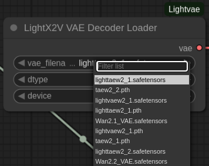

# ComfyUI-LightVAE

<div align="center">


**高性能 VAE 自定义节点**

[](https://huggingface.co/lightx2v/Autoencoders)
[](https://github.com/ModelTC/LightX2V)
[](LICENSE)

[English](README.md) | 简体中文

</div>


## 📖 简介

ComfyUI-LightVAE 是为 ComfyUI 设计的 LightX2V VAE 自定义节点集合，支持包括 **LightVAE** 和 **LightTAE** 在内的高性能视频 VAE 模型。

LightX2V 团队对 VAE 进行了深度优化，衍生出两大系列：**LightVAE** 和 **LightTAE**，在保持高质量的同时显著降低内存占用并提升推理速度。


## ✨ 核心特性

<table>
<tr>
<td width="50%">

### 🎯 LightVAE 系列
**特点：最佳平衡 ⚖️**

- ✅ 使用 **Causal 3D Conv**（与官方相同）
- ✅ **质量接近官方** ⭐⭐⭐⭐
- ✅ 内存减少 **~50%**（~4-5 GB）
- ✅ 速度提升 **2-3x**
- ✅ 平衡质量、速度和内存 🏆

</td>
<td width="50%">

### ⚡ LightTAE 系列
**特点：极速 + 高质量 🏆**

- ✅ 极低内存占用（~0.4 GB）
- ✅ 极速推理
- ✅ **质量接近官方** ⭐⭐⭐⭐
- ✅ **超越开源 TAE**

</td>
</tr>
</table>


## 🚀 性能对比

**测试环境**: H100 GPU, BF16, 81 帧视频 (480P)

| 模型 | 编码时间 | 解码时间 | 编码内存 | 解码内存 | 质量 |
|:-----|:---------|:---------|:---------|:---------|:-----|
| **lightvaew2_1** | 1.5s | 2.1s | 4.8GB | 5.6GB | ⭐⭐⭐⭐⭐ |
| **lighttaew2_1** | 0.4s | 0.25s | 0.009GB | 0.4GB | ⭐⭐⭐⭐ |
| [Wan2.1_VAE](https://github.com/Wan-Video/Wan2.1) | 4.2s | 5.5s | 8.5GB | 10.1GB | ⭐⭐⭐⭐ |
| [taew2_1](https://github.com/madebyollin/taesd) | 0.4s | 0.25s | 0.009GB | 0.4GB | ⭐⭐⭐ |

**性能提升：**
- 🚀 LightVAE 比官方 VAE **快 2-3 倍**，内存**节省 50%**
- ⚡ LightTAE 比官方 VAE **快 10+ 倍**，内存**节省 95%+**
- 🎨 质量接近官方 [VAE](https://github.com/Wan-Video/Wan2.1)，超过开源 [TAE](https://github.com/madebyollin/taesd)


## 📦 安装

### 1. 安装 LightX2V 依赖

```bash
# 克隆 LightX2V 仓库
git clone https://github.com/ModelTC/LightX2V
cd LightX2V

python setup_vae.py install
```

### 2. 安装 ComfyUI-WanVideoWrapper

LightVAE 节点依赖 WanVideoWrapper 提供的主模型支持：

```bash
cd ComfyUI/custom_nodes
git clone https://github.com/kijai/ComfyUI-WanVideoWrapper
```

### 3. 安装 ComfyUI-LightVAE

```bash
cd ComfyUI/custom_nodes
git clone https://github.com/YOUR_USERNAME/ComfyUI-LightVAE
```

### 4. 重启 ComfyUI


## 📥 下载模型

### 主模型（Diffusion Models）

**选项 1: 蒸馏模型（推荐，4-step）**
- 🔗 [Wan2.1蒸馏模型](https://huggingface.co/lightx2v/Wan2.1-Distill-Models) 和 [Wan2.2蒸馏模型](https://huggingface.co/lightx2v/Wan2.2-Distill-Models)
- ✅ 支持 BF16 格式
- ✅ 支持 FP8 格式（需使用 `_comfyui.safetensors` 后缀的模型）

**选项 2: 原始模型（20-step）**
- 🔗 [Wan2.1官方模型](https://huggingface.co/lightx2v/Wan2.1-Official-Models) 和 [Wan2.2官方模型](https://huggingface.co/lightx2v/Wan2.2-Official-Models)
- ✅ 支持 BF16 格式
- ✅ 支持 FP8 格式（需使用 `_comfyui.safetensors` 后缀的模型）

```bash
# 下载到 ComfyUI/models/diffusion_models/
huggingface-cli download lightx2v/Wan2.1/2-Distill-Models \
    --local-dir ./ComfyUI/models/diffusion_models/
```

### VAE 模型

**所有 VAE 模型**（必需）:
- 🔗 [LightX2V Autoencoders](https://huggingface.co/lightx2v/Autoencoders)

```bash
# 下载所有 VAE 模型
huggingface-cli download lightx2v/Autoencoders \
    --local-dir ./ComfyUI/models/vae/

# 或只下载需要的（推荐）
huggingface-cli download lightx2v/Autoencoders lightvaew2_1.pth \
    --local-dir ./ComfyUI/models/vae/
```

**支持的 VAE 模型**:
- `Wan2.1_VAE.pth` / `.safetensors` - 官方 VAE 2.1
- `Wan2.2_VAE.pth` / `.safetensors` - 官方 VAE 2.2
- `lightvaew2_1.pth` / `.safetensors` - 优化 VAE 2.1 ⭐ **推荐**
- `taew2_1.pth` / `.safetensors` - 开源 TAE 2.1
- `taew2_2.pth` / `.safetensors` - 开源 TAE 2.2
- `lighttaew2_1.pth` / `.safetensors` - 优化 TAE 2.1 ⚡ **最快**
- `lighttaew2_2.pth` / `.safetensors` - 优化 TAE 2.2


## 🎯 节点说明

### 1. LightX2V VAE Decoder Loader

加载 VAE 解码器模型。

**输入参数:**
- `vae_filename` - VAE 模型文件名（从 `./models/vae/` 目录自动列出）
- `dtype` - 数据类型（bfloat16 / float16 / float32）
- `device` - 计算设备（cuda / cpu）

**输出:**
- `vae` - VAE 模型对象

**特点:**
- ✅ 自动从文件名识别 VAE 类型
- ✅ 支持所有 LightX2V VAE 模型


### 2. LightX2V VAE Decode

解码 latent 到视频帧。

**输入参数:**
- `vae` - 来自 Loader 的 VAE 对象
- `latent` - 潜在表示

**输出:**
- `IMAGE` - 解码后的视频帧

**支持:**
- ✅ 所有 VAE 系列（WanVAE, LightVAE）
- ✅ 所有 TAE 系列（TAE, LightTAE）


## 🖼️ 示例工作流

### Wan2.1 I2V 4-step FP8 + LightVAE

使用 4-step 蒸馏模型 + LightVAE 优化解码器的高性能配置。


**工作流文件**: [`example/workflows/wan2.1_I2V_4step_fp8_lightvae.json`](example/workflows/wan2.1_I2V_4step_fp8_lightvae.json)

### Wan2.2 TI2V + LightVAE

Wan2.2 文本图像到视频 + LightVAE 解码。

**工作流文件**: [`example/workflows/wan2.2_TI2V_lightvae.json`](example/workflows/wan2.2_TI2V_lightvae.json)


## ⚠️ 注意事项

### 模型兼容性
- ⚠️ **Wan2.1 VAE** 只能用于 **Wan2.1/Wan2.2-A1B** 主干模型
- ⚠️ **Wan2.2 VAE** 只能用于 **Wan2.2 TI2V** 主干模型
- ❌ 不要混用不同版本的 VAE 和主干模型


## 📚 相关资源

- **项目主页**: https://github.com/ModelTC/LightX2V
- **VAE 模型**: https://huggingface.co/lightx2v/Autoencoders
- **视频生成模型**: https://huggingface.co/lightx2v/
- **ComfyUI-WanVideoWrapper**: https://github.com/kijai/ComfyUI-WanVideoWrapper
- **tae系列模型**： https://github.com/madebyollin/taesd
- **Wan-AI**： https://huggingface.co/Wan-AI


## 🙏 致谢

如果这个项目对你有帮助，请给 ⭐ [LightX2V](https://github.com/ModelTC/LightX2V) 和本仓库！


## 📞 支持

- **GitHub Issues**: 本仓库的 Issues 页面
- **LightX2V Issues**: https://github.com/ModelTC/LightX2V/issues
- **HuggingFace**: https://huggingface.co/lightx2v

<div align="center">

**享受使用 LightX2V VAE！** 🚀

</div>

